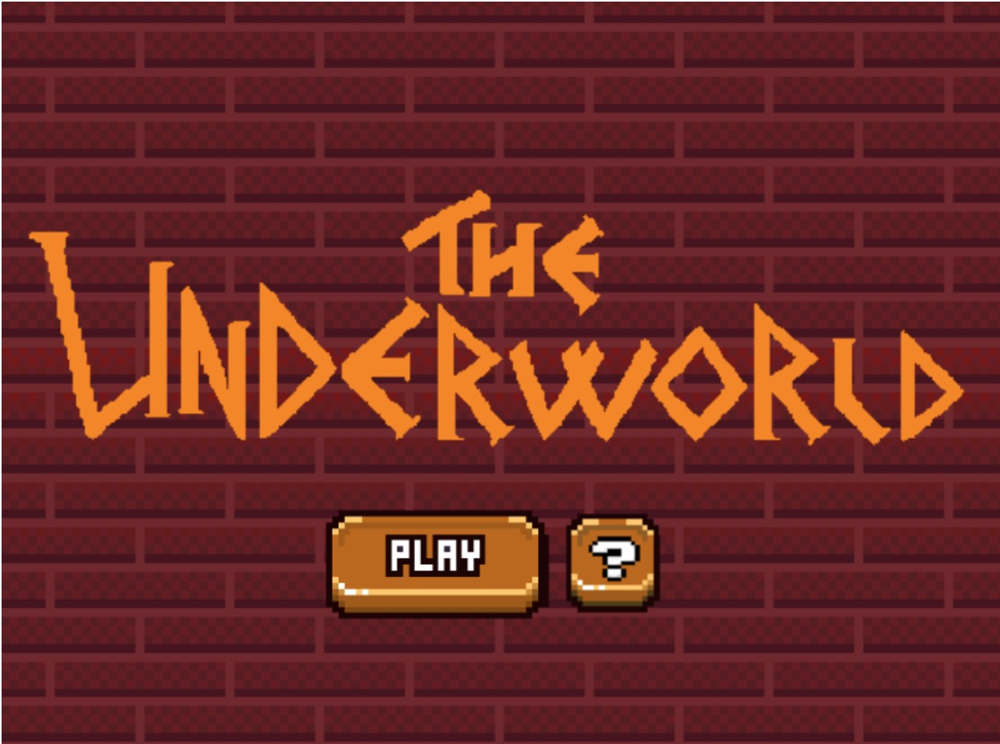
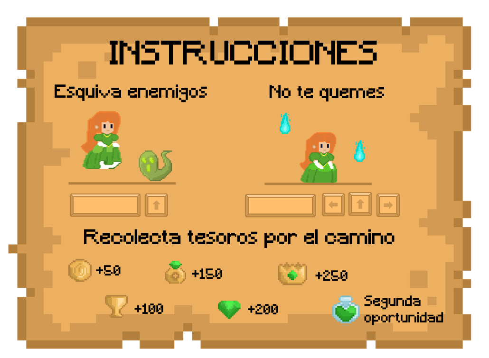
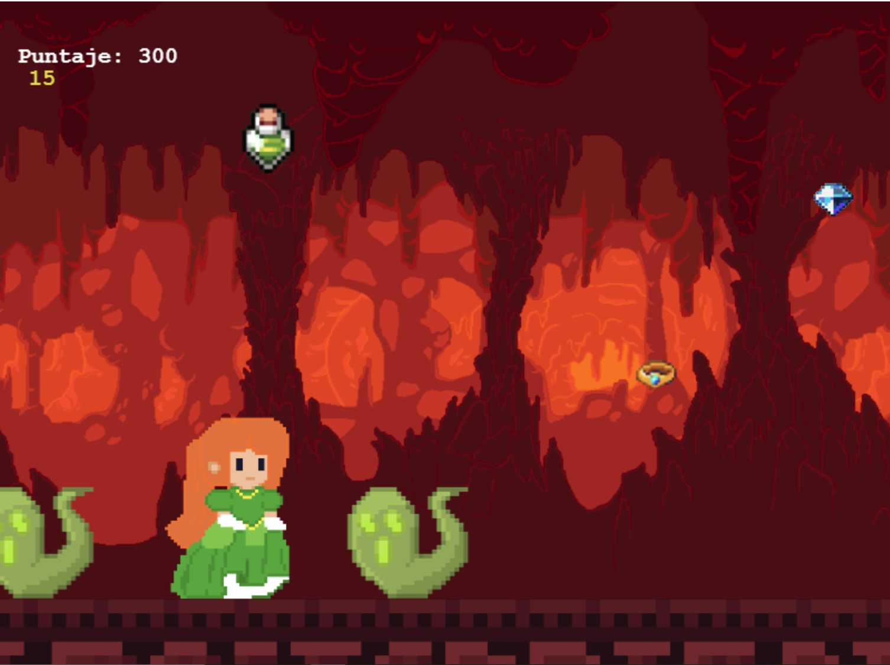

The Underworld

En este videojuego en 2D con vista lateral, inspirado en el mito griego del secuestro de Perséfone, el jugador 
debe esquivar enemigos y obstáculos, e intentar sobrevivir el mayor tiempo posible sin ser tocado.

