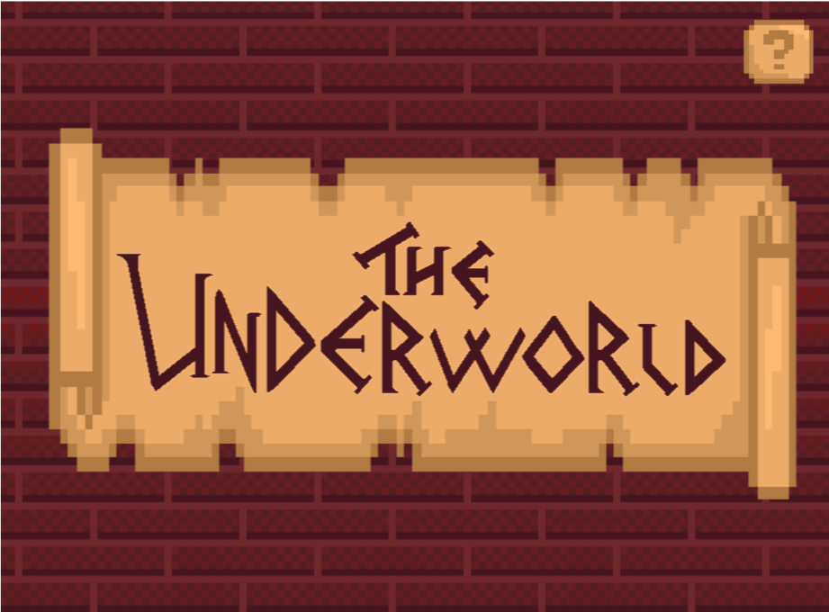
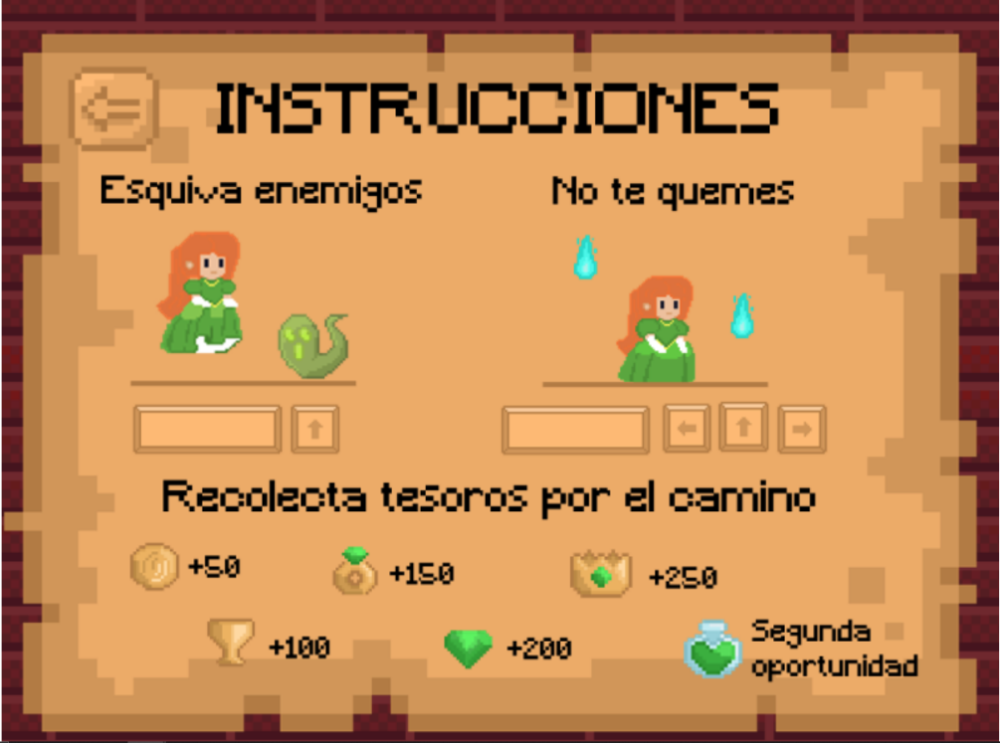
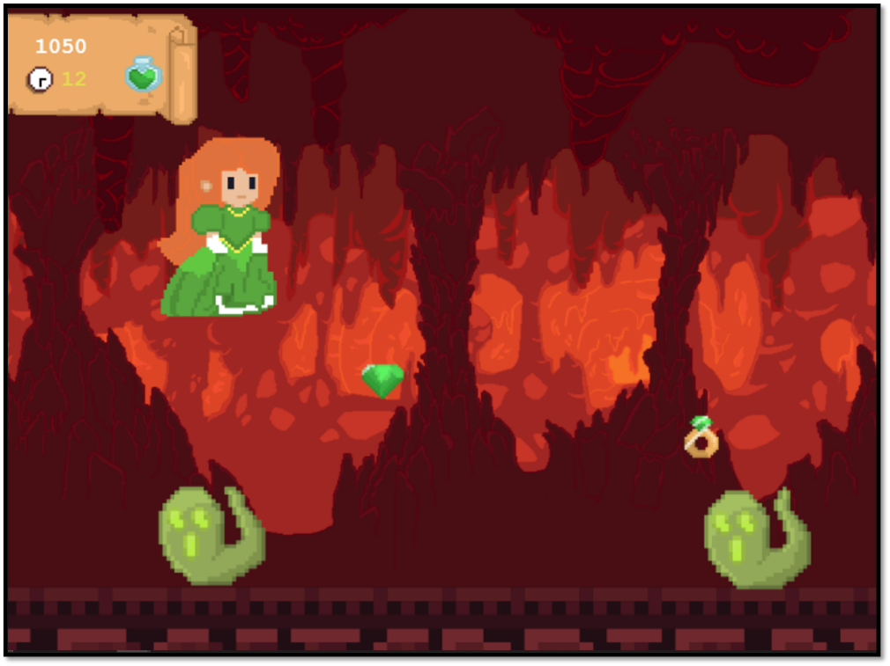
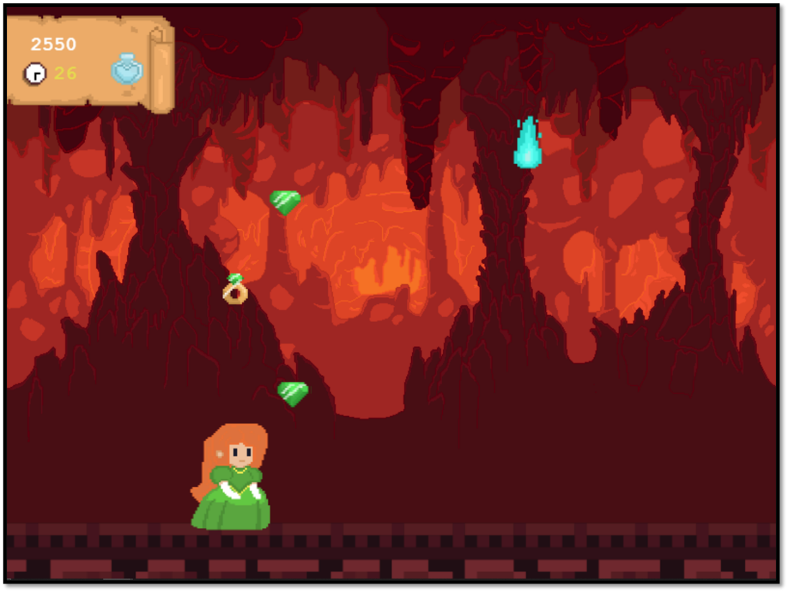
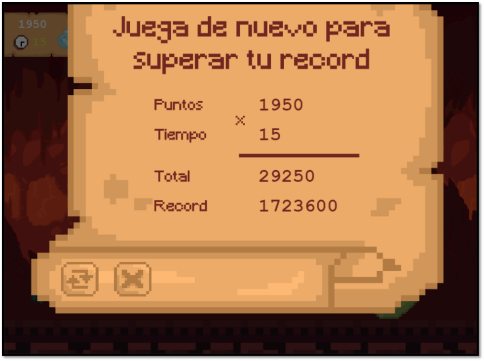

The Underworld

En este videojuego en 2D con vista lateral, inspirado en el mito griego del secuestro de Perséfone, el jugador
debe esquivar enemigos y obstáculos, e intentar sobrevivir el mayor tiempo posible sin ser tocado.

link del GDD: https://drive.google.com/file/d/1dNkT1HJ6C0HJxAGt6FvWNGe5tbqUmWSY/view?usp=sharing
Link del TDD: https://drive.google.com/file/d/1qImNdPCdRuDg25w8E-cSCTknNkk97Dq-/view?usp=sharing

